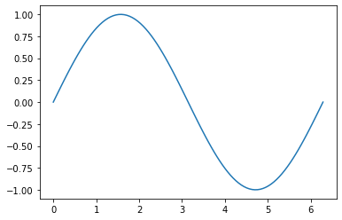

.. code:: ipython3

    # 1D Numpy: It is a library for scientific computing.
    # It has many u seful functions.
    # It has advantages like speed and memory.
    # It is similar to Lists
    # It is fixed in size
    
    a = ["0", 1, "two", '3', 4] # This is List
    print(a[2])
    
    import numpy as np
    b = np.array([1,2,3,4]) # This is numpy
    print(b[2])
    print(type(b)) # Type
    print(b.dtype) # return the type of elements. here its integer
    print(b.size) # return size
    print(b.ndim) # return dimension of array
    print(b.shape) # indicate size of array in each dimension

.. parsed-literal::

    two
    3
    <class 'numpy.ndarray'>
    int64
    4
    1
    (4,)

.. code:: ipython3

    # Operstions on arrays
    import numpy as np
    c = np.array([10,2,4,66,3])
    c[0]=100 # change 1st element to 100
    print(c)
    print(c[1:3]) # slice element rom c[1] till 3rd position
    c[1:3]=[300,400] # replace value of c[1] and c[2]
    c

.. parsed-literal::

    [100   2   4  66   3]
    [2 4]

.. parsed-literal::

    array([100, 300, 400,  66,   3])

.. code:: ipython3

    # VECTORS
    # Vectors works faster
    # Good to use when large number of data
    
    # u = [x1,y1], v = [x2,y2]
    # w = u+v = [x1+x2, y1+y2]
    
    import numpy as np
    u = np.array([1,0])
    v = np.array([0,1])
    z = u + v
    print(z)
    
    # Another method for addition of 2 vectors
    w = []
    for n,m in zip(u,v):
        w.append(n+m)
    print(w)

.. parsed-literal::

    [1 1]
    [1, 1]

.. code:: ipython3

    import numpy as np
    u = np.array([1,0])
    v = np.array([0,1])
    z = u - v
    print(z)
    
    # Another method for subtraction of 2 vectors
    w = []
    for n,m in zip(u,v):
        w.append(n-m)
    print(w)

.. parsed-literal::

    [ 1 -1]
    [1, -1]

.. code:: ipython3

    # Multiplication (HARDAMARD product)
    import numpy as np
    u = np.array([1,2])
    v = np.array([2,4])
    z = u * v
    print(z)
    
    # Another method for multiplication of 2 vectors
    w = []
    for n,m in zip(u,v):
        w.append(n*m)
    print(w)

.. parsed-literal::

    [2 8]
    [2, 8]

.. code:: ipython3

    # Dot product
    u = np.array([1,2])
    v = np.array([2,4])
    z = np.dot(u,v) # z=(x1*x2)+(y1*y2)
    print(z)

.. parsed-literal::

    10

.. code:: ipython3

    # BROADCASTING Method
    # Adding constant to numpy array
    u = np.array([1,2,3,-4])
    z = u + 10 # This will add 10 to all elements
    z

.. parsed-literal::

    array([11, 12, 13,  6])

.. code:: ipython3

    # Universal Function: Functions that operates on ndarrays
    # We can apply those functions to NUMPY array
    
    import numpy as np
    a = np.array([1,2,-1,3,7])
    mean_a = a.mean() # average 
    print(mean_a)
    max_a = a.max() # maximum value
    print(max_a)

.. parsed-literal::

    2.4
    7

.. code:: ipython3

    # map numpy array to new numpy array
    import numpy as np
    a = np.pi
    print(a)
    b = np.array([0,np.pi/2,np.pi])
    print(b)
    c = np.sin(30)
    print(c)

.. parsed-literal::

    3.141592653589793
    [0.         1.57079633 3.14159265]

.. parsed-literal::

    -0.9880316240928618

.. code:: ipython3

    import numpy as np
    a = np.linspace(-2,2,num=5)
    print(a)
    b = np.linspace(1,10,num=10)
    print(b)
    c = np.sin(30)
    print(c)

.. parsed-literal::

    [-2. -1.  0.  1.  2.]
    [ 1.  2.  3.  4.  5.  6.  7.  8.  9. 10.]
    -0.9880316240928618

.. code:: ipython3

    # Plotting math functions
    
    import numpy as np
    x = np.linspace(0,2*np.pi,100)
    y = np.sin(x)
    
    import matplotlib.pyplot as plt
    %matplotlib inline   # to display plot graph on IDE output
    plt.plot(x,y)

.. parsed-literal::

    [<matplotlib.lines.Line2D at 0x7eff1958c590>]

